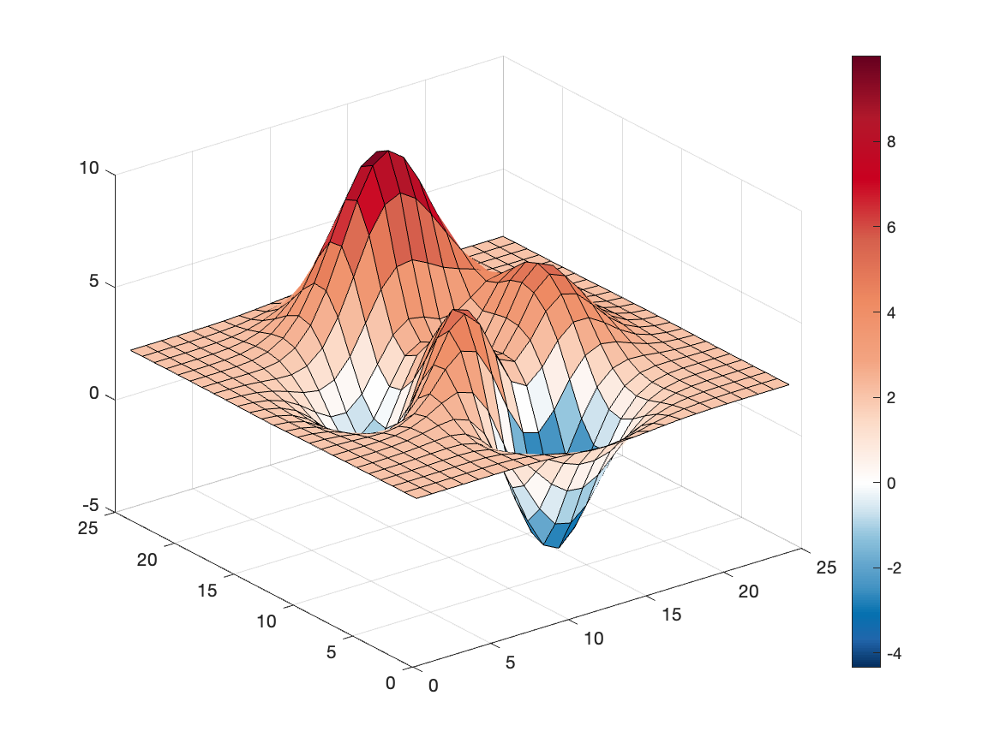
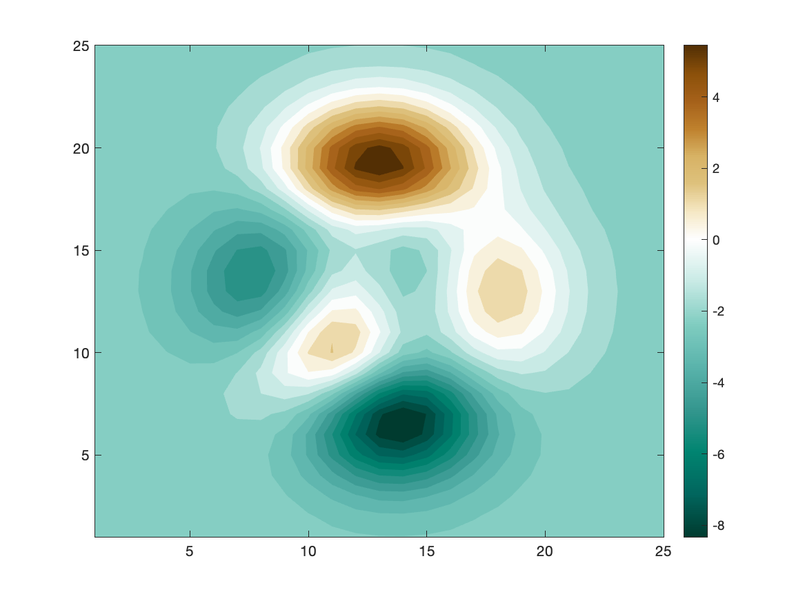

# Centered Colormap

by [Matteo Courthoud](https://matteocourthoud.github.io/)

class file: `centered.m`

example file: `example.m`

---

This package provides colormaps centered on the white color corresponding to zero. Just specify `centered`as an argument to a colormap to use the default centered colormap.

```
surf(peaks(25));
colormap(centered), colorbar
```



The function takes different color palettes as arguments.


For example, we can use the BrBg palette.

```
contourf(peaks(25),25,'linestyle','none'); 
colormap(centered('BrBg')), colorbar;
```

